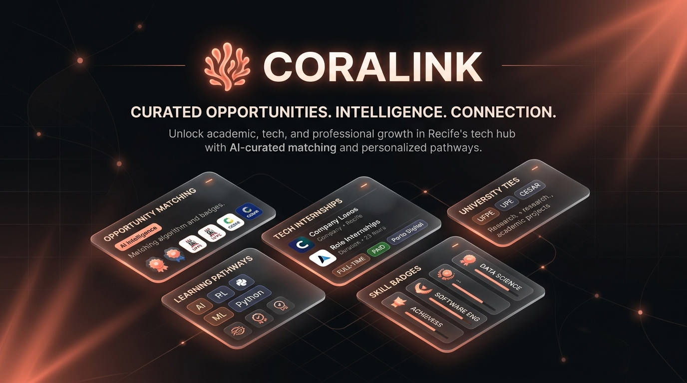

# Coralink Web



<div align="center">

[-black?style=for-the-badge&logo=next.js&logoColor=white)](https://nextjs.org/)
[](https://react.dev/)
[](https://www.typescriptlang.org/)
[](https://tailwindcss.com/)
[](https://www.framer.com/motion/)
[](https://developers.google.com/identity)
[](LICENSE)

<p align="center">
  <strong>Interface moderna, reativa e editorial para agregação e descoberta inteligente de oportunidades acadêmicas e de tecnologia.</strong>
</p>

</div>

---

## 📑 Sumário

- [1. Visão Geral](#1-visão-geral)
- [2. Destaques & Funcionalidades](#2-destaques--funcionalidades)
- [3. Arquitetura do Frontend](#3-arquitetura-do-frontend)
- [4. Segurança & Painel Administrativo Furtivo](#4-segurança--painel-administrativo-furtivo)
- [5. Pipeline Runner Interativo](#5-pipeline-runner-interativo)
- [6. Configuração e Execução Local](#6-configuração-e-execução-local)
- [7. Variáveis de Ambiente](#7-variáveis-de-ambiente)
- [8. Como Promover um Administrador](#8-como-promover-um-administrador)
- [9. Qualidade & Build](#9-qualidade--build)
- [10. Licença](#10-licença)

---

## 1. Visão Geral

O **Coralink Web** é o cliente oficial da plataforma Coralink, desenvolvido com **Next.js 16 (App Router + Turbopack)**, **React 19** e **Tailwind CSS**. A aplicação foi projetada para oferecer uma experiência de usuário de nível internacional: navegação editorial com alto refinamento estético, performance de ponta, animações fluidas a 60 FPS e conformidade jurídica integral com a LGPD e políticas do Google.

O frontend consome a [Coralink-API](https://github.com/Lucasfcz/coralinkAPI) para apresentar editais de pesquisa, bolsas de estudo, vagas de estágio e eventos de tecnologia concentrados nos principais polos de Recife e região (UFPE, CIn-UFPE, IFPE, UPE, Porto Digital, CESAR School, Facepe, Senac-PE, UNIBRA, UNIFAFIRE, Sympla).

---

## 2. Destaques & Funcionalidades

### 🎨 Design Editorial & Dark Mode Nativo
- **Estética Editorial Sofisticada**: Tipografia balanceada, contrastes elegantes e sistema de grids assimétricos (Bento Grid).
- **Dark / Light Mode Instantâneo**: Gerenciado via `useSyncExternalStore` conectado ao `localStorage`, eliminando piscadas (*flickers*) durante o carregamento inicial.
- **Micro-interações Suaves**: Rolagem inercial com [Lenis](https://github.com/darkroomengineering/lenis) e transições coordenadas.

### ⚡ Shared Element Transitions (Card para Modal)
- Implementação de física de mola (`spring`) via Framer Motion (`layoutId`), conectando fluidamente o card clicado no feed até a abertura do modal centralizado em 60 FPS, sem saltos de renderização.

### 🛡️ Painel Administrativo Furtivo (Stealth Routing)
- A rota `/admin` não expõe redirecionamento para não-autorizados; ela retorna o erro **404 (`notFound()`)** nativo do Next.js. Usuários comuns e rastreadores não conseguem deduzir a existência da rota.
- O acesso é restrito a contas com papel `ROLE_ADMIN`, com entrada discreta no menu de perfil do cabeçalho.

### 🤖 Pipeline Runner Interativo em Tempo Real
- Painel para acompanhar a esteira de raspagem e inteligência artificial (Google Gemini).
- Polling reativo a cada 2 segundos durante execuções ativas com stepper visual de fases (`SCRAPING`, `AI_EXTRACTION`, `SAVING`, `COMPLETED`, `FAILED`).
- Gatilho manual para disparo da pipeline.
- Inspeção de itens brutos coletados por lote e aba de auditoria de falhas de extração da IA.

### 📊 Gestão de Oportunidades & Soft Delete
- Tabela administrativa com filtros dinâmicos, busca textual e paginação.
- Modal de edição rápida de prazos, links e metadados.
- **Soft Delete**: Ação de desativação que ajusta a expiração para o passado, preservando o histórico da oportunidade sem deleção física.

### 🔐 Autenticação Híbrida & Resiliente
- **Google Identity Services (GSI)**: Integração com One Tap e botão personalizado com verificação criptográfica de token no backend.
- **Login / Registro Local**: Suporte a e-mail e senha tradicionais.
- **Injeção Automática de Bearer Token**: Cliente HTTP configurado para injetar credenciais automaticamente em requisições autenticadas.

### 🖼️ SafeImage & Fallback Inteligente
- Componente especializado contra imagens externas quebradas ou domínios não mapeados, acionando fallbacks temáticos de alta definição sem interromper a interface.

### 📜 Conformidade Jurídica & LGPD
- Páginas públicas dedicadas para **Termos de Uso** e **Política de Privacidade** com foro de Recife/PE e canal de atendimento e exclusão de dados.

---

## 3. Arquitetura do Frontend

O projeto adota a arquitetura modular baseada em responsabilidades claras:

```text
src/
├── app/                                 # Rotas Next.js (App Router)
│   ├── admin/                           # Painel administrativo (Stealth 404 para não-admins)
│   ├── oportunidades/[id]/              # Página de detalhes da oportunidade
│   ├── termos-de-uso/                   # Termos de uso institucionais
│   ├── politica-de-privacidade/         # Política de privacidade LGPD
│   ├── globals.css                      # Estilos globais e tokens Tailwind
│   ├── layout.tsx                       # Root Layout (Metadados, Fontes, Providers)
│   └── page.tsx                         # Landing page e feed unificado
│
├── components/                          # Componentes de Interface
│   ├── admin/                           # Dashboard, Métricas, Tabela, Pipeline Runner e Modais
│   ├── auth/                            # Modal de autenticação (Google GSI + E-mail/Senha)
│   ├── common/                          # SafeImage, InstitutionLogo, ShareModal
│   ├── featured/                        # Carrossel e Marquee de destaques
│   ├── feed/                            # Bento Grid, BentoCard, CategoryFilter, Skeletons
│   ├── layout/                          # Header com dropdown de perfil, Footer
│   ├── modal/                           # OpportunityModal com Framer Motion layoutId
│   ├── opportunity-detail/              # Visão estendida de oportunidade
│   └── providers/                       # AuthProvider, ThemeProvider, SmoothScrollProvider
│
├── hooks/                               # Hooks reutilizáveis (ScrollLock, etc.)
├── lib/                                 # Utilitários de higienização de URLs e algoritmos
├── services/                            # Clientes HTTP tipados (opportunities, admin, auth, userHelp)
└── types/                               # Definições de tipos TypeScript
```

---

## 4. Segurança & Painel Administrativo Furtivo

Para garantir que áreas restritas permaneçam completamente invisíveis ao público geral:

```mermaid
graph TD
    User([Usuário acessa /admin]) --> CheckAuth{Está Autenticado?}
    CheckAuth -- Não --> NotFound[Invoca notFound() -> HTTP 404]
    CheckAuth -- Sim --> CheckRole{Possui ROLE_ADMIN?}
    CheckRole -- Não --> NotFound
    CheckRole -- Sim --> RenderAdmin[Renderiza AdminDashboard]
```

1. **Sem Redirecionamentos Suspeitos**: Usuários não logados ou com `ROLE_USER` recebem a tela de **Página Não Encontrada (404)** idêntica a qualquer link inexistente.
2. **Exibição Condicional na UI**: O botão de acesso ao painel só é montado no DOM se a sessão pertencer a um usuário autenticado com permissão administrativa explícita.

---

## 5. Pipeline Runner Interativo

O painel de controle permite aos operadores do sistema supervisionar a esteira automatizada:

| Funcionalidade | Descrição |
| :--- | :--- |
| **Status em Tempo Real** | Exibe o estado operacional atual (`IDLE`, `SCRAPING`, `AI_EXTRACTION`, etc.). |
| **Stepper de Fases** | Visualização gráfica das etapas da esteira com pulso dinâmico na fase ativa. |
| **Disparo Manual** | Permite acionar imediatamente a coleta sem aguardar o agendador do cron. |
| **Inspeção de Itens Coletados** | Modal para inspecionar os títulos, links e status de cada oportunidade raspada em uma execução. |
| **Auditoria de Falhas** | Lista as oportunidades brutas rejeitadas pela IA com as respectivas mensagens de erro. |

---

## 6. Configuração e Execução Local

### Pré-requisitos
- **Node.js**: Versão 20.x ou superior.
- **Gerenciador de Pacotes**: `npm`, `pnpm` ou `yarn`.
- **Coralink API**: Instância da [Coralink-API](https://github.com/Lucasfcz/coralinkAPI) rodando localmente ou em nuvem.

### 1. Clonar o Repositório
```bash
git clone https://github.com/Lucasfcz/coralink.git
cd coralink
```

### 2. Instalar Dependências
```bash
npm install
```

### 3. Configurar Variáveis de Ambiente
Copie o arquivo de exemplo para criar suas variáveis locais:
```bash
cp .env.example .env.local
```

Preencha as variáveis em `.env.local` conforme detalhado na seção a seguir.

### 4. Executar em Modo de Desenvolvimento
```bash
npm run dev
```

Acesse [http://localhost:3000](http://localhost:3000) no seu navegador.

---

## 7. Variáveis de Ambiente

| Variável | Obrigatória | Padrão | Descrição |
| :--- | :---: | :--- | :--- |
| `NEXT_PUBLIC_API_URL` | Sim | `http://localhost:8080` | URL base do backend (Coralink-API). |
| `NEXT_PUBLIC_GOOGLE_CLIENT_ID` | Não | ID padrão de desenvolvimento | Client ID do Google Cloud Console para OAuth2 (GSI). |
| `NEXT_PUBLIC_SUPPORT_EMAIL` | Não | `suporte@coralink.app` | E-mail para contato, solicitações de suporte e LGPD. |

---

## 8. Como Promover um Administrador

Por padrão, todas as contas criadas via Google ou formulário local recebem a permissão `ROLE_USER`. Para promover sua conta para administrador:

1. Acesse o painel de banco de dados do seu backend (ex: **SQL Editor** do Supabase).
2. Execute o comando informando o seu e-mail:
```sql
UPDATE users 
SET role = 'ROLE_ADMIN' 
WHERE email = 'seu-email@gmail.com';
```
3. Faça logout e login novamente no Coralink Web. O link **Painel Admin** aparecerá no menu do perfil.

---

## 9. Qualidade & Build

O projeto mantém rigor estrito de código e tipagem:

```bash
# Executar verificação de linter (ESLint)
npm run lint

# Executar verificação estática de tipos TypeScript
npx tsc --noEmit

# Compilar para produção (Next.js Turbopack)
npm run build

# Iniciar servidor de produção
npm run start
```

- **Linter**: 0 erros, 0 avisos.
- **Tipagem**: 100% estrita, sem uso de `any`.

---

## 10. Licença

Este projeto é distribuído sob a licença [MIT](LICENSE). Sinta-se à vontade para utilizar, sugerir melhorias e contribuir com a comunidade acadêmica.

